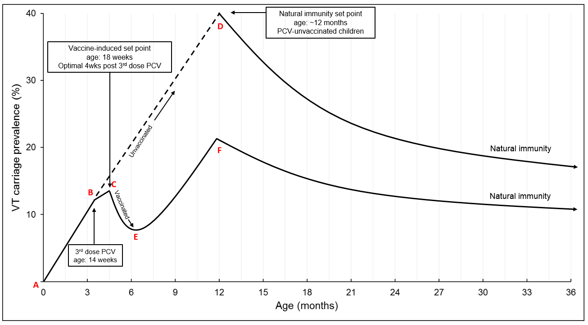

```{r, include=FALSE}
options(tinytex.verbose = TRUE)
```

```{r setup, include=FALSE}
knitr::opts_chunk$set(message = FALSE, cache = T, echo = F, warning = F, message = F,
                      fig.align = "center")
if (!require("pacman")) install.packages("pacman")
pkgs = c("ggplot2", "dplyr", "ggsci", "JLutils", "knitr", "kableExtra") # package names
pacman::p_load(pkgs, character.only = T)
```

# The scientific model

Todd and colleagues hypothesized a scientific model for pneumococcal carriage among children.

```{r science_model, fig.cap="The role of pneumococcal conjugate vaccine-induced and natural anti-pneumococcal immunity in determining the prevalence of colonisation by \\emph{S. pneumoniae} among children in a high carriage prevalence setting.", out.width="100%", fig.pos="H"}

```
**A**: Children born uncolonized with *S. pneumoniae*. **A-B**: Soon after birth, children are colonized with VT and NVT pneumococcus via contact with family and community members. **B**: At 14 weeks of age, vaccine-eligible children have received 3 doses PCV13, with optimal immunogenic response for vaccine-induced mucosal immunity 4 weeks later (**C**). Among PCV-vaccinated children, 18-weeks is the vaccine-induced set point, with a rapid decrease in VT prevalence (**C-E**) until 6 months of age (**E**). At 6 months of age, there is an increase in risk of VT carriage (**E-F**), driven by increased FoI in the context of waning vaccine-induced immunity, the former due in part to increased contact with other young children in their household and community. VT carriage prevalence increases until naturally acquired immunity starts to impact on colonisation (**F**), reducing pneumococcal carriage prevalence. Among PCV-unvaccinated children, risk of VT carriage continues to increase largely unchecked (**B-D**) until naturally acquired immunity starts to impact on colonisation (**D**), reducing pneumococcal carriage prevalence. Among these unvaccinated children, 12-months is the set-point induced by naturally-acquired immunity. Indirect vaccine effects will impact on the height of **C-F** & **B-D** and the rate of decline in VT carriage prevalence.

# Exploratory analysis 

```{r age_distribution, out.height="47%", fig.show='hold', fig.pos="H", fig.align='left'}
# Load data
cocco <- readr::read_csv("data/PCVPA_31dec_adj_claudio_.csv")
cocco <- cocco[!(cocco$pcv_vaccd == "PCV13-unvacc'd" & cocco$surv == 4 & cocco$age_y < 1), ] 

# Clean it 
cocco <- cocco[-which(is.na(cocco$surv)), ] # remove NA
cocco$age_cat <- cut(cocco$age_y, breaks = seq(0, 10, by = .5))
```

```{r nvt_dist_surv, out.height="48%", fig.align='left'}
# Ditribution of pneumococco carriage over different groups and surveys
cocco$nvt <- ifelse(cocco$carriage == "NVT", 1, 0)
ggplot(cocco, aes(x = pcv_vaccd, fill = factor(nvt))) +
  geom_bar(position = "fill") +
  stat_fill_labels(size = 2) +
  facet_wrap(~ surv, labeller = labeller(surv = function(x) paste("Survey", x))) +
  scale_x_discrete(labels = c("Unvaccinated", "Vaccinated")) +
  scale_y_continuous(labels = scales::percent) +
  scale_fill_brewer(name = "Non vaccine type\ncarriage", labels = c("No", "Yes"),
                    type = "qual", palette = 7,
                    position = "top") +
  labs(x = "", y = "") +
  theme_bw() +
  theme(panel.grid = element_blank(), 
        axis.text.x = element_text(size = 7),
        legend.position = "bottom")
```

```{r nvt_dist_age}
# Ditribution of pneumococco carriage over different age groups
cocco$pcv_vaccd <- ifelse(cocco$pcv_vaccd == "PCV13-vacc'd", "Vaccinated", "Unvaccinated")
cocco %>% 
  filter(typ_cat7 != "adult", !is.na(age_cat)) %>%
ggplot(aes(x = age_cat, fill = factor(nvt))) +
  geom_bar(position = "fill", show.legend = F) +
  stat_fill_labels(size = 1.8) +
  facet_wrap(~ pcv_vaccd, ncol = 1) +
  scale_y_continuous(labels = scales::percent) +
  scale_fill_brewer(name = "Vaccine type\ncarriage", labels = c("No", "Yes"),
                    type = "qual", palette = 7,
                    position = "top") +
  labs(x = "Age (years)", y = "") +
  theme_bw() +
  theme(panel.grid = element_blank(), 
        axis.text.x = element_text(angle = 45, hjust = 1, size = 7))
```

# Statistical models

<!-- ## Modelling strategy 1 -->

<!-- We developed a non-linear model to describe the variation in risk of VT carriage with age. The response for each child is a single binary variable, $Y_i=1/0$ representing presence/absence of VT carriage at the time of measurement, with respective probabilities $p_i$ and $1-p_i$. The modelled probability, $p_i$, of VT carriage for child $i$ is -->

<!-- \begin{equation} -->
<!-- \label{eq:unvacc} -->
<!-- \begin{cases} -->
<!-- \text{logit}^{-1}\left(\alpha + \beta age_{i}\right)  & age_{i}<\kappa_{u}\\ -->
<!-- \text{logit}^{-1}\left(\alpha + \beta\kappa_{u}\right) \exp\left\{ -\delta_{u}\left(age_{i}-\kappa_{u}\right)\right\}  & age_{i}\geq\kappa_{u} -->
<!-- \end{cases} -->
<!-- \end{equation} -->
<!-- if the child is unvaccinated and -->
<!-- \begin{equation} -->
<!-- \label{eq:vacc} -->
<!-- \begin{cases} -->
<!-- \text{logit}^{-1}\left(\alpha + \beta age_{i}\right)  & age_{i}<\kappa_{v}\\ -->
<!-- \text{logit}^{-1}\left(\alpha + \beta\kappa_{v}\right) \exp\left\{ -\delta_{u}\left(age_{i}-\kappa_{v}\right)\right\}  & age_{i}\geq\kappa_{v} -->
<!-- \end{cases} -->
<!-- \end{equation} -->
<!-- if vaccinated, where $age_i$ is the age in years of child $i$ at time of measurement, $alpha$ is an intercept term, $\beta$ is the rate of increase in VT carriage with age before either vaccination or natural immunity takes palce, $\delta_u$ and $\delta_v$ are the rates of decay of VT carriage prevalence with age for unvaccinated and vaccinated children respectively, $\kappa_v$ is the vaccine-induced set point and $\kappa_u$ is the natural immunity set point. We do not attempt to estimate these last two parameters, instead, we fixed them according to biological information (for TODD to give a strong backgroun on why we fixed $\kappa_v$ and $\kappa_u$ at 4wks and 1yr). We fixed $k_u$ to 18 weeks, 4 weeks after the third dose of PCV13 has been received. This is assumed to be the time at which immunogenic response for vaccine-induced mucosal immunity is optimal. We allowed $\kappa_v$ to vary between 6, 12, and 24 months. Results for these three models are reported below. -->

<!-- ### Model 1: $\kappa_u=2$ -->

<!-- ```{r fit_model1} -->
<!-- source("R/coccoModel.R") -->
<!-- cocco <- readRDS("data/cocco_clean.rds") -->

<!-- fit <- coccoModel(response = "vt_01", vacc = "pcv_vaccd", age = "age_y", -->
<!--                   data = cocco, delta2 = T,  -->
<!--                   kv = 0.3452055, ku = 2, -->
<!--                   ini.par = c(-1, 3, 0.1, 0.1)) -->
<!-- ``` -->

<!-- ```{r plot_model1, fig.cap="Relationship between estimated probability of VT carriage and child's age.", fig.pos="H", out.height="30%"} -->
<!-- # Bootstrap to obtain cofidence bands for predicted curve -->
<!-- library(MASS) -->
<!-- mu <- as.numeric(fit$par) -->
<!-- covar <- fit$covar -->
<!-- theta <- mvrnorm(n = 1000, mu = mu, Sigma = covar) -->

<!-- thetau <- cbind(theta[, 1:2], exp(theta[, 3]), fit$ku) -->
<!-- thetav <- cbind(theta[, 1:2], exp(theta[, 4]), fit$kv) -->

<!-- predictf <- function(x, age) { -->
<!--   alpha <- x[1] -->
<!--   beta <- x[2] -->
<!--   delta <- x[3] -->
<!--   k <- x[4] -->
<!--   logistic <- function(x) 1 / (1 + exp(- x)) -->
<!--   logistic(alpha + beta * age) * (age < k) +  -->
<!--     logistic(alpha + beta * k) * exp(- delta * (age - k)) * (age >= k) -->
<!-- }  -->

<!-- age <- seq(0, 11, l = 500) -->

<!-- fit_unvacc <- t(apply(apply(thetau, 1, predictf, age = age), 1,  -->
<!--                       quantile, prob = c(0.025, 0.975))) -->
<!-- fit_vacc <- t(apply(apply(thetav, 1, predictf, age = age), 1,  -->
<!--                     quantile, prob = c(0.025, 0.975))) -->

<!-- mean_par_vacc <- as.numeric(c(fit$results[c(1, 2, 4), 1], fit$kv)) -->
<!-- mean_par_unvacc <- as.numeric(c(fit$results[c(1, 2, 3), 1], fit$ku)) -->

<!-- fit.vacc <- predictf(mean_par_vacc, age) -->
<!-- fit.vacc.low <- fit_vacc[, 1] -->
<!-- fit.vacc.up <- fit_vacc[, 2] -->

<!-- fit.unvacc <- predictf(mean_par_unvacc, age) -->
<!-- fit.unvacc.low <- fit_unvacc[, 1] -->
<!-- fit.unvacc.up <- fit_unvacc[, 2] -->


<!-- df <- data.frame(cat = as.factor(rep(c("vaccinated", "unvaccinated"), each = length(age))), -->
<!--                  probability = c(fit.vacc, fit.unvacc), -->
<!--                  low = c(fit.vacc.low, fit.unvacc.low), -->
<!--                  up = c(fit.vacc.up, fit.unvacc.up), -->
<!--                  age = c(age, age)) -->

<!-- require(ggplot2) -->
<!-- require(ggpubr) -->

<!-- pal <- get_palette(palette = "lancet", 2) -->
<!-- size <- 11 -->
<!-- legend <- "top" -->
<!-- xlim <- 0:11 -->

<!-- ggplot(data = df, aes(x = age, y = probability, color = cat)) +  -->
<!--   geom_line(size = 0.8) + -->
<!--   xlab("age") + -->
<!--   ylab("probability of VT carriage") + -->
<!--   scale_color_manual(values = rev(pal), name = "") + -->
<!--   geom_ribbon(aes(ymin = low, ymax = up, fill = cat), alpha = 0.2, show.legend = F, -->
<!--               color = NA) + -->
<!--   theme_bw(base_size = size) + -->
<!--   theme(legend.position = legend) + -->
<!--   scale_x_continuous(breaks = xlim)  -->
<!-- ``` -->

<!-- ```{r estimate1} -->
<!-- estimates <- as.numeric(fit$results[,1]) -->
<!-- ci <- fit$results[, 2:3] -->
<!-- estimates <- round(c(estimates[1],  -->
<!--                      exp(estimates[2] / 12),  -->
<!--                      estimates[3], log(2) / estimates[3],  -->
<!--                      estimates[4], log(2) / estimates[4]), 3) -->
<!-- ci <- round(rbind(ci[1, ],  -->
<!--                   exp(ci[2, ] / 12),  -->
<!--                   ci[3, ], -->
<!--                   c(log(2) / ci[3, 2], log(2) / ci[3, 1]),  -->
<!--                   ci[4, ], -->
<!--                   c(log(2) / ci[4, 2], log(2) / ci[4, 1])), 3) -->
<!-- ci <- apply(ci, 1, function(x) paste0("(", x[1], ", ", x[2], ")")) -->
<!-- Parameter <- c("$\\hat{\\alpha}$", -->
<!--                "$\\exp(\\hat{\\beta}/12)$", -->
<!--                "$\\hat{\\delta_u}$", -->
<!--                "$\\hat{\\log(2)/\\delta_u}$", -->
<!--                "$\\hat{\\delta_v}$", -->
<!--                "$\\hat{\\log(2)/\\delta_v}$") -->
<!-- tab <- data.frame(Parameter, Estimate = as.numeric(estimates), CI = ci) -->
<!-- rownames(tab) <- NULL -->
<!-- kable(tab, booktabs = T, linesep = "", align = "l", escape = F, -->
<!--       caption = "Maximum likelihood estimates and corresponding 95\\% confidence intervals for the fitted model. Regression coefficients are reported on the odds-ratio scale.", format = "latex", -->
<!--       col.names = c("Parameter", "Estimate", "95\\% CI")) %>% -->
<!--   kable_styling(latex_options = "HOLD_position") -->
<!-- ``` -->

<!-- ### Model 2: $\kappa_u=1$ -->

<!-- ```{r fit_model2} -->
<!-- source("R/coccoModel.R") -->
<!-- cocco <- readRDS("data/cocco_clean.rds") -->

<!-- fit <- coccoModel(response = "vt_01", vacc = "pcv_vaccd", age = "age_y", -->
<!--                   data = cocco, delta2 = T,  -->
<!--                   kv = 0.3452055, ku = 1, -->
<!--                   ini.par = c(-1, 3, 0.1, 0.1)) -->
<!-- ``` -->

<!-- ```{r plot_model2, fig.cap="Relationship between estimated probability of VT carriage and child's age.", fig.pos="H", out.height="30%"} -->
<!-- # Bootstrap to obtain cofidence bands for predicted curve -->
<!-- library(MASS) -->
<!-- mu <- as.numeric(fit$par) -->
<!-- covar <- fit$covar -->
<!-- theta <- mvrnorm(n = 1000, mu = mu, Sigma = covar) -->

<!-- thetau <- cbind(theta[, 1:2], exp(theta[, 3]), fit$ku) -->
<!-- thetav <- cbind(theta[, 1:2], exp(theta[, 4]), fit$kv) -->

<!-- predictf <- function(x, age) { -->
<!--   alpha <- x[1] -->
<!--   beta <- x[2] -->
<!--   delta <- x[3] -->
<!--   k <- x[4] -->
<!--   logistic <- function(x) 1 / (1 + exp(- x)) -->
<!--   logistic(alpha + beta * age) * (age < k) +  -->
<!--     logistic(alpha + beta * k) * exp(- delta * (age - k)) * (age >= k) -->
<!-- }  -->

<!-- age <- seq(0, 11, l = 500) -->

<!-- fit_unvacc <- t(apply(apply(thetau, 1, predictf, age = age), 1,  -->
<!--                       quantile, prob = c(0.025, 0.975))) -->
<!-- fit_vacc <- t(apply(apply(thetav, 1, predictf, age = age), 1,  -->
<!--                     quantile, prob = c(0.025, 0.975))) -->

<!-- mean_par_vacc <- as.numeric(c(fit$results[c(1, 2, 4), 1], fit$kv)) -->
<!-- mean_par_unvacc <- as.numeric(c(fit$results[c(1, 2, 3), 1], fit$ku)) -->

<!-- fit.vacc <- predictf(mean_par_vacc, age) -->
<!-- fit.vacc.low <- fit_vacc[, 1] -->
<!-- fit.vacc.up <- fit_vacc[, 2] -->

<!-- fit.unvacc <- predictf(mean_par_unvacc, age) -->
<!-- fit.unvacc.low <- fit_unvacc[, 1] -->
<!-- fit.unvacc.up <- fit_unvacc[, 2] -->


<!-- df <- data.frame(cat = as.factor(rep(c("vaccinated", "unvaccinated"), each = length(age))), -->
<!--                  probability = c(fit.vacc, fit.unvacc), -->
<!--                  low = c(fit.vacc.low, fit.unvacc.low), -->
<!--                  up = c(fit.vacc.up, fit.unvacc.up), -->
<!--                  age = c(age, age)) -->

<!-- require(ggplot2) -->
<!-- require(ggpubr) -->

<!-- pal <- get_palette(palette = "lancet", 2) -->
<!-- size <- 11 -->
<!-- legend <- "top" -->
<!-- xlim <- 0:11 -->

<!-- ggplot(data = df, aes(x = age, y = probability, color = cat)) +  -->
<!--   geom_line(size = 0.8) + -->
<!--   xlab("age") + -->
<!--   ylab("probability of VT carriage") + -->
<!--   scale_color_manual(values = rev(pal), name = "") + -->
<!--   geom_ribbon(aes(ymin = low, ymax = up, fill = cat), alpha = 0.2, show.legend = F, -->
<!--               color = NA) + -->
<!--   theme_bw(base_size = size) + -->
<!--   theme(legend.position = legend) + -->
<!--   scale_x_continuous(breaks = xlim)  -->
<!-- ``` -->

<!-- ```{r estimate2} -->
<!-- estimates <- as.numeric(fit$results[,1]) -->
<!-- ci <- fit$results[, 2:3] -->
<!-- estimates <- round(c(estimates[1],  -->
<!--                      exp(estimates[2] / 12),  -->
<!--                      estimates[3], log(2) / estimates[3],  -->
<!--                      estimates[4], log(2) / estimates[4]), 3) -->
<!-- ci <- round(rbind(ci[1, ],  -->
<!--                   exp(ci[2, ] / 12),  -->
<!--                   ci[3, ], -->
<!--                   c(log(2) / ci[3, 2], log(2) / ci[3, 1]),  -->
<!--                   ci[4, ], -->
<!--                   c(log(2) / ci[4, 2], log(2) / ci[4, 1])), 3) -->
<!-- ci <- apply(ci, 1, function(x) paste0("(", x[1], ", ", x[2], ")")) -->
<!-- Parameter <- c("$\\hat{\\alpha}$", -->
<!--                "$\\exp(\\hat{\\beta}/12)$", -->
<!--                "$\\hat{\\delta_u}$", -->
<!--                "$\\hat{\\log(2)/\\delta_u}$", -->
<!--                "$\\hat{\\delta_v}$", -->
<!--                "$\\hat{\\log(2)/\\delta_v}$") -->
<!-- tab <- data.frame(Parameter, Estimate = as.numeric(estimates), CI = ci) -->
<!-- rownames(tab) <- NULL -->
<!-- kable(tab, booktabs = T, linesep = "", align = "l", escape = F, -->
<!--       caption = "Maximum likelihood estimates and corresponding 95\\% confidence intervals for the fitted model. Regression coefficients are reported on the odds-ratio scale.", format = "latex", -->
<!--       col.names = c("Parameter", "Estimate", "95\\% CI")) %>% -->
<!--   kable_styling(latex_options = "HOLD_position") -->
<!-- ``` -->

<!-- ### Model 3: $\kappa_u=2$ -->

<!-- ```{r fit_model3} -->
<!-- source("R/coccoModel.R") -->
<!-- cocco <- readRDS("data/cocco_clean.rds") -->

<!-- fit <- coccoModel(response = "vt_01", vacc = "pcv_vaccd", age = "age_y", -->
<!--                   data = cocco, delta2 = T,  -->
<!--                   kv = 0.3452055, ku = 2, -->
<!--                   ini.par = c(-1, 3, 0.1, 0.1)) -->
<!-- ``` -->

<!-- ```{r plot_model3, fig.cap="Relationship between estimated probability of VT carriage and child's age.", fig.pos="H", out.height="30%"} -->
<!-- # Bootstrap to obtain cofidence bands for predicted curve -->
<!-- library(MASS) -->
<!-- mu <- as.numeric(fit$par) -->
<!-- covar <- fit$covar -->
<!-- theta <- mvrnorm(n = 1000, mu = mu, Sigma = covar) -->

<!-- thetau <- cbind(theta[, 1:2], exp(theta[, 3]), fit$ku) -->
<!-- thetav <- cbind(theta[, 1:2], exp(theta[, 4]), fit$kv) -->

<!-- predictf <- function(x, age) { -->
<!--   alpha <- x[1] -->
<!--   beta <- x[2] -->
<!--   delta <- x[3] -->
<!--   k <- x[4] -->
<!--   logistic <- function(x) 1 / (1 + exp(- x)) -->
<!--   logistic(alpha + beta * age) * (age < k) +  -->
<!--     logistic(alpha + beta * k) * exp(- delta * (age - k)) * (age >= k) -->
<!-- }  -->

<!-- age <- seq(0, 11, l = 500) -->

<!-- fit_unvacc <- t(apply(apply(thetau, 1, predictf, age = age), 1,  -->
<!--                       quantile, prob = c(0.025, 0.975))) -->
<!-- fit_vacc <- t(apply(apply(thetav, 1, predictf, age = age), 1,  -->
<!--                     quantile, prob = c(0.025, 0.975))) -->

<!-- mean_par_vacc <- as.numeric(c(fit$results[c(1, 2, 4), 1], fit$kv)) -->
<!-- mean_par_unvacc <- as.numeric(c(fit$results[c(1, 2, 3), 1], fit$ku)) -->

<!-- fit.vacc <- predictf(mean_par_vacc, age) -->
<!-- fit.vacc.low <- fit_vacc[, 1] -->
<!-- fit.vacc.up <- fit_vacc[, 2] -->

<!-- fit.unvacc <- predictf(mean_par_unvacc, age) -->
<!-- fit.unvacc.low <- fit_unvacc[, 1] -->
<!-- fit.unvacc.up <- fit_unvacc[, 2] -->


<!-- df <- data.frame(cat = as.factor(rep(c("vaccinated", "unvaccinated"), each = length(age))), -->
<!--                  probability = c(fit.vacc, fit.unvacc), -->
<!--                  low = c(fit.vacc.low, fit.unvacc.low), -->
<!--                  up = c(fit.vacc.up, fit.unvacc.up), -->
<!--                  age = c(age, age)) -->

<!-- require(ggplot2) -->
<!-- require(ggpubr) -->

<!-- pal <- get_palette(palette = "lancet", 2) -->
<!-- size <- 11 -->
<!-- legend <- "top" -->
<!-- xlim <- 0:11 -->

<!-- ggplot(data = df, aes(x = age, y = probability, color = cat)) +  -->
<!--   geom_line(size = 0.8) + -->
<!--   xlab("age") + -->
<!--   ylab("probability of VT carriage") + -->
<!--   scale_color_manual(values = rev(pal), name = "") + -->
<!--   geom_ribbon(aes(ymin = low, ymax = up, fill = cat), alpha = 0.2, show.legend = F, -->
<!--               color = NA) + -->
<!--   theme_bw(base_size = size) + -->
<!--   theme(legend.position = legend) + -->
<!--   scale_x_continuous(breaks = xlim)  -->
<!-- ``` -->

<!-- ```{r estimate3} -->
<!-- estimates <- as.numeric(fit$results[,1]) -->
<!-- ci <- fit$results[, 2:3] -->
<!-- estimates <- round(c(estimates[1],  -->
<!--                      exp(estimates[2] / 12),  -->
<!--                      estimates[3], log(2) / estimates[3],  -->
<!--                      estimates[4], log(2) / estimates[4]), 3) -->
<!-- ci <- round(rbind(ci[1, ],  -->
<!--                   exp(ci[2, ] / 12),  -->
<!--                   ci[3, ], -->
<!--                   c(log(2) / ci[3, 2], log(2) / ci[3, 1]),  -->
<!--                   ci[4, ], -->
<!--                   c(log(2) / ci[4, 2], log(2) / ci[4, 1])), 3) -->
<!-- ci <- apply(ci, 1, function(x) paste0("(", x[1], ", ", x[2], ")")) -->
<!-- Parameter <- c("$\\hat{\\alpha}$", -->
<!--                "$\\exp(\\hat{\\beta}/12)$", -->
<!--                "$\\hat{\\delta_u}$", -->
<!--                "$\\hat{\\log(2)/\\delta_u}$", -->
<!--                "$\\hat{\\delta_v}$", -->
<!--                "$\\hat{\\log(2)/\\delta_v}$") -->
<!-- tab <- data.frame(Parameter, Estimate = as.numeric(estimates), CI = ci) -->
<!-- rownames(tab) <- NULL -->
<!-- kable(tab, booktabs = T, linesep = "", align = "l", escape = F, -->
<!--       caption = "Maximum likelihood estimates and corresponding 95\\% confidence intervals for the fitted model. Regression coefficients are reported on the odds-ratio scale.", format = "latex", -->
<!--       col.names = c("Parameter", "Estimate", "95\\% CI")) %>% -->
<!--   kable_styling(latex_options = "HOLD_position") -->
<!-- ``` -->

We developed a non-linear model to describe the variation in risk of VT carriage with age, adjusted for child-specific baseline characteristics. We don't model the increase in VT carriage during the first 12 months of life and so we excluded children aged less than 12 months at the time of measurement. We also asses the fit for censoring the data at 6 months and 24 months. The modelled probability, $p_i$, of VT carriage for child $i$ is
\begin{equation}
\label{eq:unvacc}
\alpha \beta \exp\left\{-\delta_u(age_i-t_c)\right\}
\end{equation}
if the child is unvaccinated and
\begin{equation}
\label{eq:vacc}
\alpha \exp\left\{-\delta_v(age_i-t_c)\right\}
\end{equation}
if vaccinated, where $age_i$ is the age in years of child $i$ at time of measurement, $t_c$ is the time at which we censor the data, $\beta$ is effect of not receiving the vaccination, $\delta_u$ and $\delta_v$ are the rates of decay of VT carriage prevalence with age for unvaccinated and vaccinated children respectively and $\alpha$ is the baseline prevalence. 


### Model 1: $tc=0.5$

```{r fit_modelc1}
source("R/censorModel2.R")
cocco <- readRDS("data/cocco_clean.rds")
cocco <- cocco[!(cocco$pcv_vaccd == "PCV13-unvacc'd" & cocco$surv == 4 & cocco$age_y < 1), ] 
cocco$nvt <- ifelse(cocco$carriage == "NVT", 1, 0)
tcu <- min(cocco$age_y[cocco$age_y >= 0.5 & cocco$pcv_vaccd == 0])
tcv <- 0.5

fit <- censorModel(formula = nvt ~ 1, 
                   data = cocco, 
                   ini.par = c(0.2, 0.1, 1), 
                   vacc = "pcv_vaccd",
                   age = "age_y",
                   tcu = tcv,
                   tcv = tcv,
                   method = "Nelder-Mead",
                   epsilon = 0.0001)
```

```{r plot_modelc1, fig.cap="Relationship between estimated probability of VT carriage and child's age.", fig.pos="H", out.height="30%"}
# Bootstrap to obtain cofidence bands for predicted curve
library(MASS)
mu <- as.numeric(fit$par)
covar <- fit$covar
theta <- mvrnorm(n = 1000, mu = mu, Sigma = covar)

logistic <- function(x) 1 / (1 + exp(- x))
p <- ncol(theta) - 3

thetau <- cbind(theta[, 1:p], exp(theta[, p + 1]), theta[, p + 3])
thetav <- cbind(theta[, 1:p], exp(theta[, p + 2]))

D <- fit$D
age <- seq(0, 11, l = 1000)

predictfu <- function(x, age) {
  xi <- x[1:p]
  alpha <- logistic(D %*% xi)
  alpha <- mean(alpha)
  delta <- x[p + 1]
  beta <- x[p + 2]
  alpha * beta * exp(- delta * (age - tcv))
} 

predictfv <- function(x, age) {
  xi <- x[1:p]
  alpha <- logistic(D %*% xi)
  alpha <- mean(alpha)
  delta <- x[p + 1]
  alpha * exp(- delta * (age - tcv))
} 

fit_unvacc <- t(apply(apply(thetau, 1, predictfu, age = age), 1, 
                      quantile, prob = c(0.025, 0.975)))
fit_vacc <- t(apply(apply(thetav, 1, predictfv, age = age), 1, 
                    quantile, prob = c(0.025, 0.975)))


xi <- mu[1:p]
mean_par_vacc <- as.numeric(c(xi, fit$results[c(p + 3, p + 2), 1]))
mean_par_unvacc <- as.numeric(c(xi, fit$results[p + 1, 1]))

# fit.vacc <- predictfv(mean_par_vacc, age)
fit.vacc.low <- fit_vacc[, 1]
fit.vacc <- apply(apply(thetav, 1, predictfv, age = age), 1, mean)

fit.vacc.up <- fit_vacc[, 2]

# fit.unvacc <- predictfu(mean_par_unvacc, age)
fit.unvacc.low <- fit_unvacc[, 1]
fit.unvacc <- apply(apply(thetau, 1, predictfu, age = age), 1, mean)
fit.unvacc.up <- fit_unvacc[, 2]


df <- data.frame(cat = as.factor(rep(c("vaccinated", "unvaccinated"), each = length(age))),
                 probability = c(fit.vacc, fit.unvacc),
                 low = c(fit.vacc.low, fit.unvacc.low),
                 up = c(fit.vacc.up, fit.unvacc.up),
                 age = c(age, age))

require(ggplot2)
require(ggpubr)

pal <- get_palette(palette = "lancet", 2)
size <- 11
legend <- "top"
xlim <- 0:11


df[df$age < tcu & df$cat == "unvaccinated", -1] <- NA 
df[df$age < tcv & df$cat == "vaccinated", -1] <- NA 


ggplot(data = df, aes(x = age, y = probability, color = cat)) + 
  geom_line(size = 0.8) +
  xlab("age") +
  ylab("probability of VT carriage") +
  scale_color_manual(values = rev(pal), name = "") +
  geom_ribbon(aes(ymin = low, ymax = up, fill = cat), alpha = 0.2, show.legend = F,
              color = NA) +
  theme_bw(base_size = size) +
  theme(legend.position = legend) +
  scale_x_continuous(breaks = xlim, limits = c(0, 11)) 
```

```{r estimatec1}
estimates <- as.numeric(fit$results[,1])
ci <- fit$results[, 2:3]
p <- length(estimates) - 3
estimates <- round(c(logistic(estimates[1:p]), 
                     estimates[p + 1], log(2) / estimates[p + 1], 
                     estimates[p + 2], log(2) / estimates[p + 2],
                     estimates[p + 3]), 3)
ci <- round(rbind(logistic(ci[1:p, ]), 
                  ci[p + 1, ],
                  c(log(2) / ci[p + 1, 2], log(2) / ci[p + 1, 1]), 
                  ci[p + 2, ],
                  c(log(2) / ci[p + 2, 2], log(2) / ci[p + 2, 1]),
                  ci[p + 3, ]), 3)
ci <- apply(ci, 1, function(x) paste0("(", x[1], ", ", x[2], ")"))
Parameter <- c("$\\text{logit}^{-1}(\\hat{\\alpha})$", 
               "$\\hat{\\delta_u}$",
               "$\\hat{\\log(2)/\\delta_u}$",
               "$\\hat{\\delta_v}$",
               "$\\hat{\\log(2)/\\delta_v}$",
               "$\\hat{\\beta}$")
tab <- data.frame(Parameter, Estimate = as.numeric(estimates), CI = ci)
rownames(tab) <- NULL
kable(tab, booktabs = T, linesep = "", align = "l", escape = F,
      caption = "Maximum likelihood estimates and corresponding 95\\% confidence intervals for the fitted model", format = "latex",
      col.names = c("Parameter", "Estimate", "95\\% CI")) %>%
  kable_styling(latex_options = "HOLD_position")
```

### Model 2: $tc=1$

```{r fit_modelc2}
tcv <- 1
fit <- censorModel(formula = nvt ~ 1, 
                   data = cocco, 
                   ini.par = c(0.2, 0.05, 1), 
                   vacc = "pcv_vaccd",
                   age = "age_y",
                   tcu = tcv,
                   tcv = tcv,
                   method = "Nelder-Mead",
                   epsilon = 0.0001)
```

```{r plot_modelc2, fig.cap="Relationship between estimated probability of VT carriage and child's age.", fig.pos="H", out.height="30%"}
# Bootstrap to obtain cofidence bands for predicted curve
library(MASS)
mu <- as.numeric(fit$par)
covar <- fit$covar
theta <- mvrnorm(n = 1000, mu = mu, Sigma = covar)

logistic <- function(x) 1 / (1 + exp(- x))
p <- ncol(theta) - 3
thetau <- cbind(theta[, 1:p], exp(theta[, p + 1]), theta[, p + 3])
thetav <- cbind(theta[, 1:p], exp(theta[, p + 2]))

D <- fit$D
age <- seq(0, 11, l = 1000)

predictfu <- function(x, age) {
  xi <- x[1:p]
  alpha <- logistic(D %*% xi)
  alpha <- mean(alpha)
  delta <- x[p + 1]
  beta <- x[p + 2]
  alpha * beta * exp(- delta * (age - tcv))
} 

predictfv <- function(x, age) {
  xi <- x[1:p]
  alpha <- logistic(D %*% xi)
  alpha <- mean(alpha)
  delta <- x[p + 1]
  alpha * exp(- delta * (age - tcv))
} 


fit_unvacc <- t(apply(apply(thetau, 1, predictfu, age = age), 1, 
                      quantile, prob = c(0.025, 0.975)))
fit_vacc <- t(apply(apply(thetav, 1, predictfv, age = age), 1, 
                    quantile, prob = c(0.025, 0.975)))


# xi <- mu[1:p]
# alpha <- logistic(D %*% xi)
# alpha <- mean(alpha)
# mean_par_vacc <- as.numeric(c(alpha, fit$results[c(p + 3, p + 2), 1]))
# mean_par_unvacc <- as.numeric(c(alpha, fit$results[p + 1, 1]))

# fit.vacc <- predictfv(mean_par_vacc, age)
fit.vacc.low <- fit_vacc[, 1]
fit.vacc <- apply(apply(thetav, 1, predictfv, age = age), 1, mean)
fit.vacc.up <- fit_vacc[, 2]

# fit.unvacc <- predictfu(mean_par_unvacc, age)
fit.unvacc.low <- fit_unvacc[, 1]
fit.unvacc <- apply(apply(thetau, 1, predictfu, age = age), 1, mean)
fit.unvacc.up <- fit_unvacc[, 2]


df <- data.frame(cat = as.factor(rep(c("vaccinated", "unvaccinated"), each = length(age))),
                 probability = c(fit.vacc, fit.unvacc),
                 low = c(fit.vacc.low, fit.unvacc.low),
                 up = c(fit.vacc.up, fit.unvacc.up),
                 age = c(age, age))

require(ggplot2)
require(ggpubr)

pal <- get_palette(palette = "lancet", 2)
size <- 11
legend <- "top"
xlim <- 0:11

df[df$age < tcu & df$cat == "unvaccinated", -1] <- NA 
df[df$age < tcv & df$cat == "vaccinated", -1] <- NA 

ggplot(data = df, aes(x = age, y = probability, color = cat)) + 
  geom_line(size = 0.8) +
  xlab("age") +
  ylab("probability of VT carriage") +
  scale_color_manual(values = rev(pal), name = "") +
  geom_ribbon(aes(ymin = low, ymax = up, fill = cat), alpha = 0.2, show.legend = F,
              color = NA) +
  theme_bw(base_size = size) +
  theme(legend.position = legend) +
  scale_x_continuous(breaks = xlim, limits = c(0, 11))
```

```{r estimatec2}
estimates <- as.numeric(fit$results[,1])
ci <- fit$results[, 2:3]
p <- length(estimates) - 3
estimates <- round(c(logistic(estimates[1:p]), 
                     estimates[p + 1], log(2) / estimates[p + 1], 
                     estimates[p + 2], log(2) / estimates[p + 2],
                     estimates[p + 3]), 3)
ci <- round(rbind(logistic(ci[1:p, ]), 
                  ci[p + 1, ],
                  c(log(2) / ci[p + 1, 2], log(2) / ci[p + 1, 1]), 
                  ci[p + 2, ],
                  c(log(2) / ci[p + 2, 2], log(2) / ci[p + 2, 1]),
                  ci[p + 3, ]), 3)
ci <- apply(ci, 1, function(x) paste0("(", x[1], ", ", x[2], ")"))
Parameter <- c("$\\text{logit}^{-1}(\\hat{\\alpha})$", 
               "$\\hat{\\delta_u}$",
               "$\\hat{\\log(2)/\\delta_u}$",
               "$\\hat{\\delta_v}$",
               "$\\hat{\\log(2)/\\delta_v}$",
               "$\\hat{\\beta}$")
tab <- data.frame(Parameter, Estimate = as.numeric(estimates), CI = ci)
rownames(tab) <- NULL
kable(tab, booktabs = T, linesep = "", align = "l", escape = F,
      caption = "Maximum likelihood estimates and corresponding 95\\% confidence intervals for the fitted model. Regression coefficients are reported on the odds-ratio scale.", format = "latex",
      col.names = c("Parameter", "Estimate", "95\\% CI")) %>%
  kable_styling(latex_options = "HOLD_position")
```

### Model 3: $tc=2$

```{r fit_modelc3}
tcv <- 2
fit <- censorModel(formula = nvt ~ 1, 
                   data = cocco, 
                   ini.par = c(0.2, 0.05, 1), 
                   vacc = "pcv_vaccd",
                   age = "age_y",
                   tcu = tcv,
                   tcv = tcv,
                   method = "Nelder-Mead",
                   epsilon = 0.0001)
```

```{r plot_modelc3, fig.cap="Relationship between estimated probability of VT carriage and child's age.", fig.pos="H", out.height="30%"}
# Bootstrap to obtain cofidence bands for predicted curve
# Bootstrap to obtain cofidence bands for predicted curve
library(MASS)
mu <- as.numeric(fit$par)
covar <- fit$covar
theta <- mvrnorm(n = 1000, mu = mu, Sigma = covar)

logistic <- function(x) 1 / (1 + exp(- x))
p <- ncol(theta) - 3
thetau <- cbind(theta[, 1:p], exp(theta[, p + 1]), theta[, p + 3])
thetav <- cbind(theta[, 1:p], exp(theta[, p + 2]))

D <- fit$D
age <- seq(0, 11, l = 1000)

predictfu <- function(x, age) {
  xi <- x[1:p]
  alpha <- logistic(D %*% xi)
  alpha <- mean(alpha)
  delta <- x[p + 1]
  beta <- x[p + 2]
  alpha * beta * exp(- delta * (age - tcv))
} 

predictfv <- function(x, age) {
  xi <- x[1:p]
  alpha <- logistic(D %*% xi)
  alpha <- mean(alpha)
  delta <- x[p + 1]
  alpha * exp(- delta * (age - tcv))
} 


fit_unvacc <- t(apply(apply(thetau, 1, predictfu, age = age), 1, 
                      quantile, prob = c(0.025, 0.975)))
fit_vacc <- t(apply(apply(thetav, 1, predictfv, age = age), 1, 
                    quantile, prob = c(0.025, 0.975)))


# xi <- mu[1:p]
# alpha <- logistic(D %*% xi)
# alpha <- mean(alpha)
# mean_par_vacc <- as.numeric(c(alpha, fit$results[c(p + 3, p + 2), 1]))
# mean_par_unvacc <- as.numeric(c(alpha, fit$results[p + 1, 1]))

# fit.vacc <- predictfv(mean_par_vacc, age)
fit.vacc.low <- fit_vacc[, 1]
fit.vacc <- apply(apply(thetav, 1, predictfv, age = age), 1, mean)
fit.vacc.up <- fit_vacc[, 2]

# fit.unvacc <- predictfu(mean_par_unvacc, age)
fit.unvacc.low <- fit_unvacc[, 1]
fit.unvacc <- apply(apply(thetau, 1, predictfu, age = age), 1, mean)
fit.unvacc.up <- fit_unvacc[, 2]


df <- data.frame(cat = as.factor(rep(c("vaccinated", "unvaccinated"), each = length(age))),
                 probability = c(fit.vacc, fit.unvacc),
                 low = c(fit.vacc.low, fit.unvacc.low),
                 up = c(fit.vacc.up, fit.unvacc.up),
                 age = c(age, age))

require(ggplot2)
require(ggpubr)

pal <- get_palette(palette = "lancet", 2)
size <- 11
legend <- "top"
xlim <- 0:11

df[df$age < tcu & df$cat == "unvaccinated", -1] <- NA 
df[df$age < tcv & df$cat == "vaccinated", -1] <- NA 


ggplot(data = df, aes(x = age, y = probability, color = cat)) + 
  geom_line(size = 0.8) +
  xlab("age") +
  ylab("probability of VT carriage") +
  scale_color_manual(values = rev(pal), name = "") +
  geom_ribbon(aes(ymin = low, ymax = up, fill = cat), alpha = 0.2, show.legend = F,
              color = NA) +
  theme_bw(base_size = size) +
  theme(legend.position = legend) +
  scale_x_continuous(breaks = xlim, limits = c(0, 11))
```

```{r estimatec3}
estimates <- as.numeric(fit$results[,1])
ci <- fit$results[, 2:3]
p <- length(estimates) - 3
estimates <- round(c(logistic(estimates[1:p]), 
                     estimates[p + 1], log(2) / estimates[p + 1], 
                     estimates[p + 2], log(2) / estimates[p + 2],
                     estimates[p + 3]), 3)
ci <- round(rbind(logistic(ci[1:p, ]), 
                  ci[p + 1, ],
                  c(log(2) / ci[p + 1, 2], log(2) / ci[p + 1, 1]), 
                  ci[p + 2, ],
                  c(log(2) / ci[p + 2, 2], log(2) / ci[p + 2, 1]),
                  ci[p + 3, ]), 3)
ci <- apply(ci, 1, function(x) paste0("(", x[1], ", ", x[2], ")"))
Parameter <- c("$\\text{logit}^{-1}(\\hat{\\alpha})$", 
               "$\\hat{\\delta_u}$",
               "$\\hat{\\log(2)/\\delta_u}$",
               "$\\hat{\\delta_v}$",
               "$\\hat{\\log(2)/\\delta_v}$",
               "$\\hat{\\beta}$")
tab <- data.frame(Parameter, Estimate = as.numeric(estimates), CI = ci)
rownames(tab) <- NULL
kable(tab, booktabs = T, linesep = "", align = "l", escape = F,
      caption = "Maximum likelihood estimates and corresponding 95\\% confidence intervals for the fitted model. Regression coefficients are reported on the odds-ratio scale.", format = "latex",
      col.names = c("Parameter", "Estimate", "95\\% CI")) %>%
  kable_styling(latex_options = "HOLD_position")
```

### Model 4: $tc=3.6$

```{r fit_modelc4}
tcv <- tcu
fit <- censorModel(formula = nvt ~ 1, 
                   data = cocco, 
                   ini.par = c(0.2, 0.05, 1), 
                   vacc = "pcv_vaccd",
                   age = "age_y",
                   tcu = tcv,
                   tcv = tcv,
                   method = "Nelder-Mead",
                   epsilon = 0.0001)
```

```{r plot_modelc4, fig.cap="Relationship between estimated probability of VT carriage and child's age.", fig.pos="H", out.height="30%"}
# Bootstrap to obtain cofidence bands for predicted curve
# Bootstrap to obtain cofidence bands for predicted curve
library(MASS)
mu <- as.numeric(fit$par)
covar <- fit$covar
theta <- mvrnorm(n = 1000, mu = mu, Sigma = covar)

logistic <- function(x) 1 / (1 + exp(- x))
p <- ncol(theta) - 3
thetau <- cbind(theta[, 1:p], exp(theta[, p + 1]), theta[, p + 3])
thetav <- cbind(theta[, 1:p], exp(theta[, p + 2]))

D <- fit$D
age <- seq(0, 11, l = 1000)

predictfu <- function(x, age) {
  xi <- x[1:p]
  alpha <- logistic(D %*% xi)
  alpha <- mean(alpha)
  delta <- x[p + 1]
  beta <- x[p + 2]
  alpha * beta * exp(- delta * (age - tcv))
} 

predictfv <- function(x, age) {
  xi <- x[1:p]
  alpha <- logistic(D %*% xi)
  alpha <- mean(alpha)
  delta <- x[p + 1]
  alpha * exp(- delta * (age - tcv))
} 


fit_unvacc <- t(apply(apply(thetau, 1, predictfu, age = age), 1, 
                      quantile, prob = c(0.025, 0.975)))
fit_vacc <- t(apply(apply(thetav, 1, predictfv, age = age), 1, 
                    quantile, prob = c(0.025, 0.975)))


# xi <- mu[1:p]
# alpha <- logistic(D %*% xi)
# alpha <- mean(alpha)
# mean_par_vacc <- as.numeric(c(alpha, fit$results[c(p + 3, p + 2), 1]))
# mean_par_unvacc <- as.numeric(c(alpha, fit$results[p + 1, 1]))

# fit.vacc <- predictfv(mean_par_vacc, age)
fit.vacc.low <- fit_vacc[, 1]
fit.vacc <- apply(apply(thetav, 1, predictfv, age = age), 1, mean)
fit.vacc.up <- fit_vacc[, 2]

# fit.unvacc <- predictfu(mean_par_unvacc, age)
fit.unvacc.low <- fit_unvacc[, 1]
fit.unvacc <- apply(apply(thetau, 1, predictfu, age = age), 1, mean)
fit.unvacc.up <- fit_unvacc[, 2]


df <- data.frame(cat = as.factor(rep(c("vaccinated", "unvaccinated"), each = length(age))),
                 probability = c(fit.vacc, fit.unvacc),
                 low = c(fit.vacc.low, fit.unvacc.low),
                 up = c(fit.vacc.up, fit.unvacc.up),
                 age = c(age, age))

require(ggplot2)
require(ggpubr)

pal <- get_palette(palette = "lancet", 2)
size <- 11
legend <- "top"
xlim <- 0:11

df[df$age < tcu & df$cat == "unvaccinated", -1] <- NA 
df[df$age < tcv & df$cat == "vaccinated", -1] <- NA 


ggplot(data = df, aes(x = age, y = probability, color = cat)) + 
  geom_line(size = 0.8) +
  xlab("Age (years)") +
  ylab("Probability of VT carriage") +
  scale_color_manual(values = rev(pal), name = "", lab = c("Unvaccinated", "Vaccinated")) +
  geom_ribbon(aes(ymin = low, ymax = up, fill = cat), alpha = 0.2, show.legend = F,
              color = NA) +
  theme_bw(base_size = size) +
  theme(legend.position = legend) +
  scale_x_continuous(breaks = xlim, limits = c(0, 11))
```

```{r estimatec4}
estimates <- as.numeric(fit$results[,1])
ci <- fit$results[, 2:3]
p <- length(estimates) - 3
estimates <- round(c(logistic(estimates[1:p]), 
                     estimates[p + 1], log(2) / estimates[p + 1], 
                     estimates[p + 2], log(2) / estimates[p + 2],
                     estimates[p + 3]), 3)
ci <- round(rbind(logistic(ci[1:p, ]), 
                  ci[p + 1, ],
                  c(log(2) / ci[p + 1, 2], log(2) / ci[p + 1, 1]), 
                  ci[p + 2, ],
                  c(log(2) / ci[p + 2, 2], log(2) / ci[p + 2, 1]),
                  ci[p + 3, ]), 3)
ci <- apply(ci, 1, function(x) paste0("(", x[1], ", ", x[2], ")"))
Parameter <- c("$\\text{logit}^{-1}(\\hat{\\alpha})$", 
               "$\\hat{\\delta_u}$",
               "$\\hat{\\log(2)/\\delta_u}$",
               "$\\hat{\\delta_v}$",
               "$\\hat{\\log(2)/\\delta_v}$",
               "$\\hat{\\beta}$")
tab <- data.frame(Parameter, Estimate = as.numeric(estimates), CI = ci)
rownames(tab) <- NULL
kable(tab, booktabs = T, linesep = "", align = "l", escape = F,
      caption = "Maximum likelihood estimates and corresponding 95\\% confidence intervals for the fitted model. Regression coefficients are reported on the odds-ratio scale.", format = "latex",
      col.names = c("Parameter", "Estimate", "95\\% CI")) %>%
  kable_styling(latex_options = "HOLD_position")
```

<!-- \autoref{fig:plot} shows the estimated probabilities (solid lines) and pointwise 95% confidence limits (shaded regions) of VT carriage as functions of a child’s age, for unvaccinated children whose baseline characteristics translate to a prevalence of 0.4 at age 1 year (red) and for unvaccinated children with the same baseline characteristics (blue). -->


<!--
# References
\setlength{\parindent}{-0.2in}
\setlength{\leftskip}{0.2in}
\setlength{\parskip}{8pt}
\vspace*{-0.2in}
\noindent
-->
